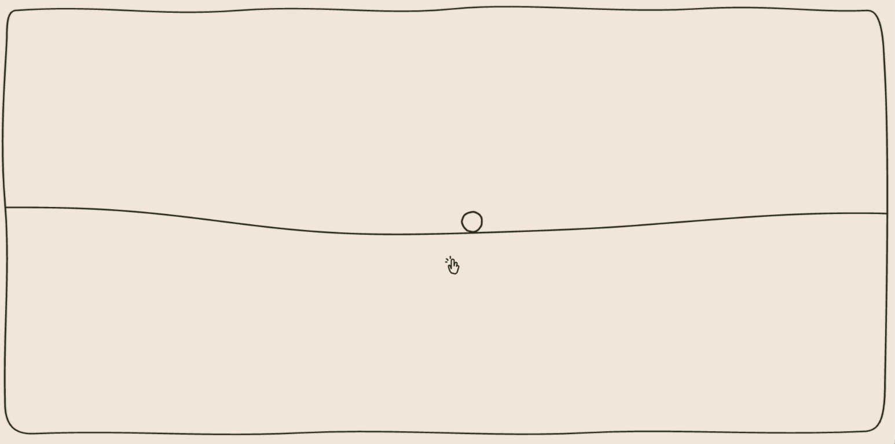
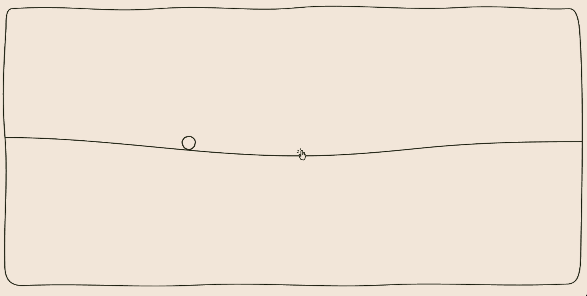

# Little Interactive Reading Site

A small, playful React site in progress. The long-term goal is to make a calm
place to read personal text—such as a CV—with little interactive pieces
surrounding the reading area. The interactions should feel tactile and hand
drawn, not like a collection of unrelated widgets.



## Current prototype

The current page is an interactive SVG wave inside a hand-drawn frame:

- Move the pointer around the wave to influence its shape and motion.
- Click the wave to drop a ball onto it.
- Use the drop button to drop the ball from the middle.
- The ball bounces, rolls with the wave’s slope, and can travel off-screen.
  An arrow points toward it and shows an approximate distance.

## Current modules

### Wave + Ball



An interactive brush-drawn wave responds to pointer movement. A ball can be
dropped onto it, roll with its contours, bounce off boundaries, and travel
off-screen. The wave and ball are currently composed in the
`WigglyLine` component, using shared brush-path and physics helpers.

## Built with

- **React** for composing the page from independent components. The intended
  layout puts reading content and small interactions side by side, so each can
  be developed, tuned, and reused as a module without making the whole page a
  single tightly coupled experience.
- **TypeScript** for component, motion, and physics types.
- **Vite** for local development and production builds.
- **SCSS** for the palette, brush-stroke layers, and animation styling.
- **SVG** for the frame, wave, ball, cursor, and arrow. The wave and ball
  outlines are updated as SVG paths rather than drawn on a canvas.
- **`requestAnimationFrame`** for the animation loop and frame-based motion.

There is no separate physics or animation package; the prototype uses small
local helpers so their behavior can be reused and tuned.

## Getting started

Install dependencies and start the Vite development server:

```sh
npm install
npm run dev
```

Other available scripts:

```sh
npm run build
npm run preview
npm run lint
```

## Reusable physics helpers

`src/Physics.tsx` contains the shared physics settings and helpers. Import the
settings and only the helpers an interaction needs:

```ts
import {
  integrateMotion,
  PHYSICS,
  resolveSurfaceImpact,
  stepSpring,
} from './Physics';
```

- **`PHYSICS`** centralizes gravity, restitution, rolling behavior, and speed
  limits. Tune these values before adding one-off constants to a component.
- **`integrateMotion(motion, deltaSeconds, acceleration?)`** advances a
  position and velocity using elapsed seconds. Supply a custom acceleration
  for motion that is not in free fall.
- **`resolveSurfaceImpact(motion, options)`** resolves velocity against a
  surface normal. Optional surface velocity, masses, and restitution let a
  moving or differently weighted surface be represented.
- **`stepSpring(value, velocity, deltaSeconds, stiffness, damping)`** advances
  a simple damped spring, useful for soft UI motion.

Use seconds for `deltaSeconds` and keep mutable motion state in a ref or local
simulation object when it is updated on every animation frame. That avoids
triggering a React render for every physics step.

The wave-specific model is separate in `src/physics/wave.ts`. It owns the wave
state, pointer-driven motion, surface sampling, and SVG path generation. Keep
generic motion helpers in `Physics.tsx`; put interaction-specific behavior in
its own model or component.

## Project structure

```text
src/
  App.tsx                         Root page composition
  Physics.tsx                     Shared physics constants and helpers
  physics/wave.ts                 Wave state, sampling, and path generation
  components/
    BrushPath/                    Layered SVG brush-stroke paths
    DropBallButton/               Reusable ball-drop control
    SvgLineText/                  Text positioned along an SVG line
    wigglyLine/                   Wave, ball, cursor, and off-screen indicator
  index.scss                      Palette and global brush-stroke styles
docs/images/
  interactive-wave.png             Screenshot used above
  wave-ball-module.png              Current Wave + Ball module
```

The root currently displays the wave prototype. As the site grows, `App.tsx`
can compose a central reading area with independent interactive components
around it. This modular pattern lets the text remain readable and focused
while surrounding interactions provide small moments of play. Each component
owns its presentation and local behavior; shared needs such as physics and
brush strokes live in reusable modules. New pieces can therefore be added or
rearranged without rewriting the reading area or duplicating the common
interaction foundations.

## Inspiration

- The project is inspired by
[`shan-shui-inf`](https://github.com/LingDong-/shan-shui-inf), a procedural,
infinitely scrolling vector landscape project that generates SVG using
JavaScript, noise, and mathematical functions. That project is a reference for
the expressive possibilities of generated SVG—not code or artwork used by
this prototype. Here, the wave is currently generated from sampled functions
and smooth curves, with the aim of bringing a similar sense of organic,
living drawing to a personal reading site.


- MS Paint 
