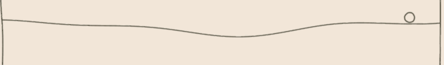
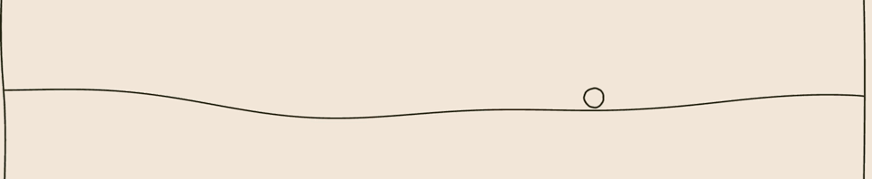

# Bounce animation: root cause and fix

## Problem

The ball could keep squishing after it had settled against the wave or the
frame edge. The squash should communicate an impact, not a resting state.

## Root-cause fishbone

```text
Wave contact: impact pose could stay active ───────┐
Floor contact: tiny residual bounces looked new ───┼──> Squash repeated at rest
Animation state: impact pose outlived the motion ──┘
```

The animation was being driven by collision events without consistently ending
when the ball became supported and stopped moving.

## Solution

- Move the bounce squash timing and strength curve into shared physics helpers
  so other interactions can reuse the same effect.
- Clear the impact pose when the ball is resting on the wave.
- Treat low-speed contact at the frame floor as rest instead of bouncing again.
- Keep impact squash for stronger, actual impacts.

The shared curve lives in `src/Physics.tsx`; wave collision and rest detection
remain specific to the wave-and-ball interaction.

## Recorded examples

These clips show the wave and ball at two viewport sizes.




